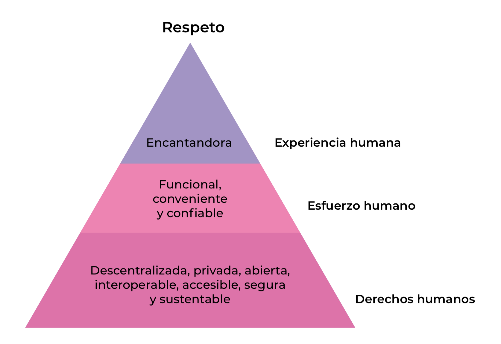

---
title: 'Derechos humanos y seguridad digital: una pareja perfecta'
description: Esta publicación es el tercer documento de la serie Análisis de políticas sobre ciberseguridad y derechos humanos en Latinoamérica, que desarrollan en conjunto las organizaciones TEDIC de Paraguay, la Asociación por los Derechos Civiles (ADC) de Argentina y la Fundación Karisma de Colombia. Ha sido posible gracias al apoyo y financiación de Privacy International y Ford Foundation.
autor: Maricarmen Sequera, TEDIC, Leandro Ucciferri, ADC, Amalia Toledo, Fundación Karisma
cover-image: cover.png
...

Esta publicación es el tercer documento de la serie *Análisis de políticas sobre ciberseguridad y derechos humanos en Latinoamérica*, que desarrollan en conjunto las organizaciones TEDIC de Paraguay, la Asociación por los Derechos Civiles (ADC) de Argentina y la Fundación Karisma de Colombia. Ha sido posible gracias al apoyo y financiación de Privacy International y Ford Foundation.

**Autores:**  
Maricarmen Sequera, TEDIC,  
Leandro Ucciferri, ADC  
Amalia Toledo, Fundación Karisma

**Colaboración**:  
Luis Pablo Alonzo Fulchi

**Revisión**:  
Francisco Vera Hott

**Diseño editorial**:  
Diantres

**Diagramación**:  
Horacio Oteiza

**Junio 2018**  

Este manual está disponible bajo Licencia Creative Commons Reconocimiento-Compartir Igual 4.0.

Usted puede remezclar, retocar y crear a partir de esta obra, incluso con fines comerciales, siempre y cuando le dé crédito al autor y licencie nuevas creaciones bajo las mismas condiciones. Para ver una copia de esta licencia visite:  
<https://creativecommons.org/licenses/by-sa/4.0/deed.es_ES>

# Introducción

El buen funcionamiento y sostenibilidad de una empresa depende en gran medida de su adaptación al medio. Actualmente, las empresas tecnológicas se encuentran inmersas en constante cambio. Uno de ellos es la creciente importancia que ha cobrado la seguridad digital, convirtiéndose en una prioridad.

Que un emprendimiento resguarde su seguridad digital significa que puede gestionar los riesgos asociados a mantener la confidencialidad, integridad y disponibilidad de su información, y muy especialmente la de las personas usuarias, a través sus procesos, tecnologías y personal. En este contexto, resulta de gran relevancia que las personas responsables del emprendimiento digital y el desarrollo de tecnología en general conozcan en detalle cuál es el modelo de economía digital que se adapta mejor a estándares de protección de los derechos humanos.

Esta guía no (y probablemente, ninguna guía por sí sola) va a responder todas tus dudas sobre privacidad y seguridad digital. Su objeto es ayudar a que tu emprendimiento digital considere la seguridad y privacidad de las personas usuarias desde un punto de vista de derechos humanos. Si te interesa conocer estándares y recursos técnicos para complementar las recomendaciones de esta guía, existen varios recursos disponibles en la red respecto a buenas prácticas en seguridad digital.[^1]

[^1]: Para más información sobre estándares técnicos de seguridad digital, recomendamos revisar: <https://www.incibe.es/protege-tu-empresa/herramientas/politicas>   <https://www.cyberessentials.ncsc.gov.uk/>  
<https://www.nist.gov/cyberframework>  
<https://www.itgovernance.co.uk/iso27000-family>  

Para esta publicación, hemos tenido en cuenta diversos estándares de derechos humanos y empresas tales como los [Principios Rectores sobre las empresas y derechos humanos](https://www.ohchr.org/documents/publications/guidingprinciplesbusinesshr_sp.pdf) (en adelante, Principios Rectores) de la Organización de las Naciones Unidas; la Guía del sector TIC para la implementación de los Principios Rectores, elaborada por la Comisión Europea; y las Directrices de aplicación de los principios relativos a la libertad de expresión y la privacidad del Global Network Initiative.

A partir de las entrevistas realizadas a Koga ImpactLab, OkimoVisión app, InnovandoPy – Startups– programa de la Secretaría Nacional de Tecnología y Comunicación de Paraguay, y un programador independiente de Argentina, se desarrolló y validó esta guía imprescindible para que los emprendimientos digitales sean competitivos, seguros y confiables en internet.

# Aspectos legales necesarios para gestionar la seguridad digital empresarial

## Aviso de privacidad: qué son y para qué sirven

Hoy en día, un sitio web es más que la carta de presentación de una compañía, muchas veces es el espacio en el que una empresa desarrolla sus negocios. En ese contexto, es esencial que las reglas sean fijadas con anterioridad y sean claras.
Esas reglas deben traducirse en una política de privacidad que refleje las prácticas del sitio web, incluyendo el tratamiento de datos personales y la seguridad de los mismos. Esta política debe reflejar cómo el sitio web usa los datos personales de sus personas usuarias y cómo cumple con la legislación de datos personales que corresponda.

Cabe tener presente que hoy en día el estándar de protección más exigente es el incorporado en el Reglamento General de Protección de Datos de la Unión Europea, que puede ser aplicable a cualquier servicio que apunte a personas que se encuentren dentro de la Unión. Para un negocio que tenga alcance global, como la mayoría de los productos y servicios online, es recomendable partir del cumplimiento de la legislación del país respectivo y del reglamento europeo.

En relación con la protección de la seguridad de datos personales, hay dos aspectos que hay que tener particularmente en cuenta: (1) la implementación de medidas de seguridad para mantener la confidencialidad, integridad y disponibilidad de los datos, y (2) las políticas de notificación a las autoridades y personas usuarias respecto a incidentes de seguridad, tales como filtraciones de datos.

Por otra parte, resulta sumamente importante que se refleje cuál es la política de actuación de la empresa ante solicitudes de acceso de datos de sus personas usuarias para el funcionamiento de su servicio digital por parte del Estado. Es importante señalar de manera clara qué información es obtenida y conservada respecto de las comunicaciones de la persona usuaria, ya sea el contenido o los metadatos, datos de suscripción y bajo qué circunstancias sucede.

Asimismo, una política de privacidad debe informar respecto de la temporalidad de 
la conservación de los datos. Y, por último, debe informar bajo qué 
circunstancias las autoridades acceden a los datos de sus personas usuarias, además de los procedimientos que se siguen para analizar y aceptar una solicitud por parte de una autoridad judicial.

A todo esto se lo llama política de protección de datos y privacidad. Estas 
políticas viene aparejada de lo que en inglés se conoce como Law Enforcement 

Guidelines (directrices de aplicación de la ley), que sirven para orientar a las autoridades policiales en el proceso de solicitud de información a las compañías sobre cuentas de sus personas usuarias. ¿Cuáles son los requerimientos 
para retener el contenido? Información general sobre la política de privacidad, términos de servicios y reglas generales.

Algunos ejemplos que te pueden servir de referencia a la hora de elaborar tu 
política de privacidad y directrices sobre aplicación de la ley son:

* Kefir, servicio de servidores
* Matomo, servicio de estadísticas
* Instagram, red social
* Riseup, servicio de correo
* Twitter, red social

De otra parte, vale la pena señalar que un grupo de organizaciones internacionales de protección de derechos humanos han señalado que las empresas deben establecer e implementar condiciones de servicio que sean transparentes, claras y accesibles. Además, deben apegarse a las normas y principios internacionales de derechos humanos, incluyendo las condiciones en las que pueden generarse interferencias con el derecho a la privacidad de las personas usuarias.[^2]

[^2]: CIDH. (2013, 31 de diciembre). Libertad de expresión e Internet. OEA/Ser.L/V/II CIDH/RELE/INF.11/13, párr. 112. . Disponible en https://bit.ly/1QiIOCC.

Es indispensable que tu emprendimiento digital cuente con políticas que cumplan estos protocolos a la hora de entregar información personal y datos personales a las autoridades.

## Autorización judicial

La vigilancia sin consentimiento de la persona afectada conlleva riesgos de abusos por las autoridades. Por ello, resulta imprescindible la autorización de un tribunal competente. Para solicitar información personal debe existir una autorización judicial tal como lo expresan las normas penales y constitucionales pertinentes.

La interceptación de las comunicaciones privadas de las personas tiene carácter excepcional. Si se efectúa de manera ilegal, suele generar penas de nulidad en el juicio. Por ello, es recomendable que las empresas cuenten con mecanismos de verificar y protocolos de entrega de información a una autoridad judicial. Es decir, debe verificarse que la orden contenga detalles del expediente penal, número de causa, datos de la persona, el tipo base penal en el que incurre la persona investigada, argumentación legal y firma del juez o jueza de la causa.

En ese sentido, se debe tener en cuenta que los metadatos deben seguir el mismo procedimiento aplicable a cualquier contenido en la comunicación. La sentencia de la Corte Interamericana de Derechos Humanos, en el caso Esher vs. Brasil, que los metadatos de las llamadas telefónicas forman parte de la comunicación, por lo tanto, deben ser tratados como tal.[^3]

[^3]: Corte IDH (2009, 6 de julio de 2009). Caso Escher y Otros vs. Brasil, punto 114. Disponible en https://bit.ly/2sIY18p.

Es indispensable que las empresas tengan en cuenta que solo mediante una orden judicial puede facilitarse información para interceptaciones de comunicaciones por parte de las autoridades penales.

## Notificación a personas afectadas

Un emprendimiento digital debe contar con una política de notificación a las personas afectados por medidas de vigilancia estatal, en el marco de lo permitido por la ley. Esto colabora con los principios de defensa legal y fomenta una cultura de protección de la privacidad.
Cuando a las personas usuarias se les informa que su información de cuenta o de conexión a internet fueron exigidas por las autoridades administrativas o judiciales, hay una expansión de las oportunidades de ejercer efectivamente su derecho de defensa contra abusos e irregularidades. El impacto que tienen las notificaciones para garantizar una defensa efectiva no es una idea nueva. A la luz del principio constitucional del debido proceso, muchas leyes establecen la obligación de notificar a las personas sobre las medidas que afectan a sus derechos.

**¿Qué dicen los organismos internacionales y grupos expertos sobre la implementación de una política de notificación para los emprendimientos digitales?**

Este derecho de notificación a las personas afectadas por medidas de vigilancia ha sido reconocido por especialistas en derechos humanos en internet. Además, fue plasmado en un documento llamado Necesario y proporcional, en donde se señala que:

>Es imposible que una persona impugne efectivamente la interferencia de un gobierno en su vida privada si no sabe si ha sido víctima. En líneas generales, la falta de transparencia respecto a la aplicación de las leyes que rigen la vigilancia encubierta puede impedir el control democrático significativo de esas leyes.[^4]

[^4]: Necesarios & Proporcionados. Principios Internacionales sobre la Aplicación de los Derechos Humanos a la Vigilancia de las Comunicaciones (2014, 10 de julio), p. 36. Disponible en https://bit.ly/1Uf4uMi.

Por otro lado, la Relatoría especial sobre el derecho a la libertad de expresión de la Organización de las Naciones Unidas expresó su opinión al respecto:

> Los individuos deben contar con el derecho a ser notificados que han sido sujetos de medidas de vigilancia de sus comunicaciones o que sus comunicaciones han sido accedidas por el Estado. Reconociendo que la notificación previa o concurrente puede poner en riesgo la efectividad de la vigilancia, los individuos deben ser notificados, en cualquier caso, una vez que la vigilancia ha sido completada y se cuenta con la posibilidad de buscar la reparación que proceda respecto del uso de medidas de vigilancia de las comunicaciones.[^5]

[^5]: La Rue, F. (2013, 17 de abril). Informe del Relator especial sobre el derecho a la libertad de opinión y expresión. A/HRC/23/40, párr. 82. Disponible en https://bit.ly/2sId3LO.

Es decir, la notificación podría no poder llevarse a cabo de inmediato en tanto se podría frustrar el éxito de una investigación, pero debería al menos efectuarse cuando no esté en riesgo una investigación, no exista riesgo de fuga, de destrucción de evidencia o el conocimiento no genere un riesgo inminente de peligro a la vida o integridad de alguna persona.

En los casos en que las solicitudes de datos no vayan acompañadas de la obligación de guardar confidencialidad frente a la solicitud, la notificación es permitida por la ley (dada la ausencia de prescripción legal al contrario). La posibilidad de notificar a las personas afectadas puede ser necesaria no solo en los casos de solicitudes de datos en procesos civiles, sino también en relación con las solicitudes realizadas por otras agencias gubernamentales tales como un Ministerio de Hacienda, reguladores de telecomunicaciones, etc.

Algunos ejemplos de políticas de notificación son:

* Twitter
* Caso Twitter vs. Holder

**¿Qué es un informe de transparencia?**

Un informe de transparencia entrega al público un resumen de las políticas y acciones de gobiernos y privados que afectan la privacidad, la libertad de expresión y la seguridad de las personas.

Publicar informes de transparencia se ha convertido en una práctica común de las compañías de tecnología y telecomunicaciones. La primera empresa que presentó un informe de transparencia fue Google en 2010 como respuesta a la erosión de la confianza que supuso las revelaciones de Edward Snowden.

En América Latina no es una práctica extendida, pero existen iniciativas de la sociedad civil latinoamericana que están impulsando a las compañías que operan en la región a trabajar en este tema.[^6]

[^6]: http://bit.ly/2u1csqu, varias organizaciones de la sociedad civil latinoamericana han trabajado en versiones en Argentina, Chile, Colombia, México, Perú y Paraguay.

**¿Qué deben contener los informes de transparencia?**

Los informes de transparencia han visto una evolución natural. Por lo general, se encuentran datos estadísticos de solicitudes gubernamentales o de personas privadas de información personal, cuentas o de remoción de contenidos, tipos de solicitudes, porcentajes de solicitudes rechazadas, impugnadas y respondidas, y cómo notifican a las personas afectadas por las solicitudes.

Según los servicios que ofrece la compañía, su compromiso público con los derechos humanos y la seguridad digital, su capacidad, etc., los informes pueden contener incluso más información. Por ejemplo, guías o principios para responder a solicitudes gubernamentales, porcentaje de solicitudes de preservación de información, número de peticiones de restricción o cancelación de cuentas, acciones tomada para oponer una solicitud o una restricción legal que impide informar sobre peticiones de información, etc.

Con el pasar de los años, los informes de transparencia también han empezado a considerar temas de seguridad digital. Por ejemplo, las compañías han empezado a presentar información sobre los esfuerzos que realizan para mejorar la seguridad digital de sus servicios y plataformas (ej. cifrado de las comunicaciones o de información privada), o la forma cómo abordan las vulnerabilidades de seguridad (ej. brechas de seguridad). Esto abona a la construcción de confianza si hay una comunicación clara y honesta sobre el tema.

**¿Con qué frecuencia se debe publicar un informe de transparencia?**

En términos de periodicidad, lo importante es comprometerse a publicar regularmente los informes de transparencia. Algunas empresas lo hace cada trimestres, mientras que otras lo hace cada semestre o anualmente.

**¿Por qué hacer informes de transparencias?**

Esta forma de transparencia arroja luz sobre las acciones de los gobiernos.[^7] Hasta cierto punto, permite al público conocer el nivel de injerencia de los gobiernos en información privada que gestionan las compañías. También ayuda a conocer el alcance que pueden tener los gobiernos sobre la libertad de expresión en línea. El tipo de información disponible en los informes de transparencia, además, puede ayudar a las personas a tomar decisiones informadas sobre la fiabilidad y seguridad digital de los proveedores que utilizarán.

[^7]: Tradicionalmente, en el mundo corporativo se asocia la transparencia con el compromiso y/o la obligación de las compañías de hacer pública su información financiera y evitar la corrupción.

También puede verse como una herramienta para la construcción de confianza con tu público objetivo. Asimismo, es un medio para declarar los compromiso de tu emprendimiento con los derechos humanos frente a la excesiva injerencia de los gobiernos en la información de sus ciudadanía. Como una consecuencia indirecta, con esta forma de transparencia se promueve la rendición de cuenta de los gobiernos e incluso de tu propio emprendimiento.

Algunos ejemplos de informes de transparencia de emprendimientos digitales son:

* El informe de transparencia de la compañía Telia, que incluye estadísticas solicitudes convencionales y no convencionales de la policía y otras autoridades en nueve países. También elabora un informe de sostenibilidad, donde hace un recuento de los casos en que defienden la privacidad y otros temas de derechos humanos.
* Informe de transparencia de Google, que contiene información estadística sobre seguridad y privacidad, y acceso a la información.

## Propiedad intelectual e innovación abierta

**¿Qué es la propiedad intelectual?**

La propiedad intelectual concede el monopolio de explotación económica a quien crea o tiene la titularidad de un obra o invención por un lapso de tiempo. Tiene dos categorías: (1) la propiedad industrial, que incluye patentes de invención, marcas, diseños industriales e indicaciones geográficas; y (2) el derecho de autor, que abarca obras artísticas y literarias, películas, música, diseños arquitectónicos, e incluso otorga derechos intérpretes y ejecutantes, productores de fonogramas y radiodifusores.[^8]

[^8]: OMPI. (s.f.). ¿Qué es la propiedad intelectual?, p. 2. Disponible en <https://bit.ly/1F48qZj>.

En el entorno digital, los derechos de autor no rigen solamente sobre los contenidos que se comparten. También se extienden al software, permitiendo regular su copia y adaptación, ya sea para adoptar un modelo basado en el secreto y las licencias exclusivas o privativas, o un modelo abierto basado en la libertad de usar, modificar y mejorar el software, lo que a su vez redunda en una mayor seguridad del mismo.

**¿Qué papel juega la propiedad intelectual para las startups?**

Los emprendimientos digitales enfrentan mucha presión para adoptar estrategias de propiedad diseñadas para excluir a otras personas del uso de sus ideas e invenciones. De esa manera, se asume que podrán impedir que algún competidor copie sus ideas o reduzcan sus posibilidades de obtener financiación, y que eso es positivo para su negocio.

Sin embargo, en el sector de la tecnología es cada vez más habitual el desarrollo de sistemas de propiedad intelectual abiertos, que permiten que otras personas y empresas tengan la posibilidad de acceder, participar, colaborar y hasta contribuir al desarrollo de las ideas e innovaciones de una empresa. A esta aproximación se le conoce como innovación abierta.

**¿Qué es la innovación abierta?**

La innovación abierta presume que deben compartirse las ideas y el conocimiento. Es decir, que “las empresas pueden y deben utilizar tanto ideas externas como internas, así como vías internas y externas para comercializar su tecnología”.[^9] Y esto se puede dar con clientes, proveedores, universidades o centros de investigación y hasta con competidores.

[^9]: Chesbrough, H.W. (2003). Open Innovation: The new imperative for creating and profiting from technology. Boston, USA: Harvard Business School Press.

La innovación abierta involucra la voluntad de reconocer que el conocimiento producido dentro de la empresa pueda extenderse a otras, incluso con la expectativa de poder recibir a cambio conocimientos de otras. Un modelo opuesto a la visión proteccionista de la propiedad intelectual, pero que no tiene porqué ser incompatible.

Este estándar reconoce que en la actualidad existe una amplia distribución del conocimiento, principalmente debido a internet, por lo tanto, una empresa no puede confiar en sus propios activos y en las innovaciones que surgen solo de sus investigaciones internas. Además, debido a su pequeño tamaño y la falta de recursos, los emprendimientos digitales no suelen disponer de los recursos humanos y financieros necesarios para introducir una nueva tecnología o producto en el mercado. Por lo tanto, las fuentes externas son esenciales en el proceso de innovación de los emprendimientos digitales, ya sea para adquirir los recursos de los que carecen o acceder a activos complementarios.

**¿Qué beneficios tiene para un emprendimiento digital adoptar una estrategia de innovación abierta?**

Citando las palabras de Richard D. Barlett, cofundador de Loomio, una empresa que ayuda a las personas en los procesos colaborativos de toma de decisiones, “las ideas son baratas y un competidor motivado puede copiarte tanto si eres abierto como si eres cerrado. Lo que importa es la ejecución...”[^10] En este sentido, la innovación abierta permite establecer un modelo de negocio que anime a los emprendimientos a conectarse con fuentes externas para que pueda sacar provecho de las nuevas oportunidades de productos, atraer gente talentosa y colaborar con otros para crear innovaciones que por sí solas no podrían hacer.

[^10]: Open Source Startup: Why We Give Away All Our IP (2016, 8 de agosto). Medium. Disponible en <https://bit.ly/2kqU2ZN>.

Algunos beneficios del innovación abierta son:

* Mayores posibilidades de crear nuevos servicios y productos
* Mejor escenario para mejorar productos y servicios existentes
* Construcción de una comunidad fuerte y talentosa dedicada al proyecto
* Mayor compromiso de los equipo de trabajo
* Más relevancia del negocio y la posibilidad de encontrar un nicho que añada valor a la empresas
* Reducción de costos y mayor eficiencia
* Aceleración del tiempo de comercialización
* Nuevas fuentes de ingresos
* Reducción del riesgo de fracaso
* Fomento de la sostenibilidad

**¿Hay ejemplos de empresas de tecnologías que hayan optado por la innovación abierta?**

Alrededor del mundo y en el sector de las tecnologías pueden encontrarse multiplicidad de ejemplos de empresa o personas emprendedoras que han abrazado el modelo de innovación abierta. Veamos.

* **Telsa** | Elon Musk, fundador de la empresa, creó un consorcio de patentes de código abierto de la tecnología utilizada para construir sus vehículos eléctricos con la esperanza de aumentar la adopción de esta tecnología y mejorar la infraestructura de apoyo.
* **Facebook** | Dentro de la empresa se organizan hackatones para que participen las personas que trabajan ahí. La idea es invitar a que el equipo de trabajo, independientemente de que sean o no desarrolladores, generen nuevas ideas e innovaciones, y hagan versiones iniciales de ellas.
* **Apple** | Aunque es el ejemplo típico de una empresa muy cerrada y reservada en cuanto a su trabaja en investigación y desarrollo (I+D), también han incorporado la innovación abierta en el desarrollo de aplicaciones de los productos iOS. Cualquiera con conocimiento puede desarrollar aplicaciones, lo que permite a las personas usuarias personalizar su experiencia. Esto beneficia tanto a la plataforma como a las personas.
* **Telegram** | Aunque la mensajería instantánea es un mercado muy competitivo, Telegram ha ganado mucha gente gracias a su facilidad, apertura y al hecho de que permite a cualquier persona crear su propio contenido (stickers).
* **Samsung** | Existen múltiples ejemplos de innovación abierta en esta empresa, pero una de ellas es la reciente adquisición de SmartThings, una compañía dedicada a la internet de las cosas (IoT, del inglés). Con ello, Samsung obtuvo una plataforma de IoT sin tener que gastar el dinero e invertir tiempo en I+D, mientras SmartThings continúa operando de forma independiente con los recursos de una gran empresa.
* **Lego** | Aunque no es un empresa de tecnología, sí es un ejemplo de cómo involucrar a la comunidad para crear más valor. De una parte, con la página web Create and Share, los miembros de la comunidad tienen un lugar de interacción en donde comparten sus diseños e imágenes. En el sitio Lego Ideas, la empresa hace lanzamientos de nuevos productos, algunos incluso propuesto por miembros de la comunidad.

## Responsabilidad de intermediarios

**¿Qué es un intermediario de internet?**

Un intermediario de internet da acceso, aloja, transmitir e indexa contenidos originados por terceras personas o prestar servicios basados en internet a terceras personas. Hay muchos tipos diferentes de intermediarios de internet. Están aquellos que proveen acceso a internet y los que ofrecen servicios de contenido como, por ejemplo, las plataformas en línea y servicios de almacenamiento.
Algunos ejemplos de intermediarios son los operadores de redes, proveedores de infraestructura de red (ej. Cisco) o de acceso a internet (ej. Movistar, cibercafés), empresas que proporcionan servicios digitales (ej. correo electrónico, transporte compartido), proveedores de alojamiento y almacenamiento en línea, redes sociales, etc.

**¿Qué es la responsabilidad de intermediarios?**

Cuando se habla de responsabilidad a lo que nos referimos es a la obligación que tienen los intermediarios de impedir que se produzcan actividades ilícitas o perjudiciales por parte de las personas que usan sus servicios. La inobservancia de este requisito puede dar lugar a consecuencias legales que obliguen al intermediario a actuar o lo expongan a acciones legales civiles o penales. Esto último depende mucho de la legislación y decisiones judiciales nacionales a la que esté sujeto el intermediario.

La responsabilidad puede producirse por muchas razones, entre las que se incluyen las infracciones por derechos de autor, piratería digital, litigios sobre marcas comerciales, por gestión de redes, por spam y suplantación de identidad (phishing), por delitos informáticos, difamación, incitación al odio, imágenes de explotación o abuso sexual infantil, por contenidos ofensivos pero legales, a partir de leyes y reglamentos sobre radiodifusión y telecomunicaciones, y para la protección de la intimidad.

**¿Por qué a un emprendimiento digital le debe importar este tema?**

Seguramente tu emprendimiento digital te convierte en intermediario. Es probable que la razón misma de tu negocio resida en el hecho de que seas un intermediario. Por lo que debe interesarte que existan normas sobre exoneración de responsabilidades en el país donde tu emprendimiento se encuentra ubicado. De esta forma, el contenido de terceras personas que ha sido transmitido, almacenado o referenciado en el servicio que proveas no te hará responsable.

Además, las políticas o legislaciones de responsabilidad de intermediarios por el contenido creado por una tercera persona tiene significativos impactos en los derechos humanos y en el desarrollo de entornos propicios para la innovación.

Un marco de referencia de garantías mínimas y buenas prácticas en este tema son los Principios de Manila sobre responsabilidad de intermediarios. Es una buena herramienta para trabajar localmente en legislación sobre exoneración de responsabilidad de intermediarios en tu país.

# Aspectos tecnológicos para una seguridad digital empresarial

## ¿Qué es la privacidad por diseño?

¿Cuántas veces te has parado a preguntar qué estoy haciendo para cuidar la privacidad de las personas que usan mis servicio?
La privacidad no solamente es un derecho fundamental que todas las personas gozan por el simple hecho de ser personas, si no que hoy en día se ha convertido en un factor determinante para la consolidación de la confianza sobre una marca o producto, ya que las personas lo relacionan directamente con una sensación de protección.

La privacidad por diseño es una filosofía de trabajo que ayuda a pensar la implementación de la misma en todos los aspectos del desarrollo de un producto, servicio o negocio en general, a partir de una actitud proactiva. Así, la privacidad es pensada como un activo y no como un costo o una carga extra que pesará sobre la innovación y el crecimiento del emprendimiento.[^11]
En el mundo, empresas como Apple y ProtonMail han puesto la privacidad al frente de su modelo de negocios, lo cual las ha puesto en una posición de ventaja competitiva frente a sus contrapartes.

[^11]:Sequera, M., Toledo, A. & Ucciferri, L. (2018). Principio 5. Derechos humanos y seguridad digital: una pareja perfecta, p. 22. Disponible en <https://bit.ly/2LqeoOe>.

## ¿Por qué brindar transparencia al desarrollo de mi producto?

Previamente abordamos algunos aspectos de la transparencia en el apartado sobre temáticas legales, pero ¿qué implica ser transparentes desde un punto de vista tecnológico?

Si bien la transparencia involucra aspectos como las prácticas empresariales utilizadas, el modelo de negocios implementado, la estructura y financiamiento, también es importante enfocarse en la tecnología que se está desarrollando o implementando.

El software libre y el código abierto son dos conceptos que se encuentran relacionadas y comparten similitudes. Existen quienes dicen que a los efectos prácticos son lo mismo, pero también quienes identifican dos movimientos y dos filosofías.[^12]

[^12]: Para una discusión más completa sobre software libre y código abierto, véase Alonzo Fulchi, L. (2011). El movimiento de software libre en Uruguay, Luis, pp. 11-12. Disponible en <http://wiki.lupa18.org/>.

Por un lado, el software libre es una filosofía que ha ido tomando tracción como movimiento social, enfocándose en el respeto de 4 libertades fundamentales: libertad ejecución del programa como se desee, libertad de estudiar cómo funciona y de adaptarlo para que pueda realizar nuevas tareas, la libertad de distribuir copias para ayudar a otros, así como también copias de versiones modificadas.[^13] El el código abierto es un modelo de desarrollo de software basado en el trabajo colaborativo que agrega una serie de criterios; la definición de la Open Source Initiative incorpora un total de 10 criterios.[^14]

[^13]: Free Software Foundation. (s.f.). ¿Qué es el software libre? Disponible en <https://bit.ly/1AAX8OJ>.
[^14]: What is open source software? (s.f.). Opensource.com. Disponible en <https://red.ht/1OB9j3X>. Para una definición de la Open Software Initiative (OSI), véase <https://opensource.org/osd>.

La posibilidad de acceso y distribución libre del código fuente habilita la circulación del conocimiento y potencia su evolución y aumenta la innovación; permite mejorar sus cualidades y prestaciones; corregir los errores que surgen en los procesos de desarrollo; y adaptarlo a las necesidades de grupos o comunidades específica. Esto funciona mucho mejor en los casos que el software libre se vuelve comunitario, es decir, cuando se crean grandes comunidades de personas que lo utilizan y se involucran en su desarrollo.

La importancia del código fuente es que determina el funcionamiento del software y de los dispositivos informáticos y, por lo tanto, quien controle el código fuente puede controlar toda información procesada electrónicamente. El poder está en el código fuente. Ser transparentes con respecto al código y al manejo del poder puede ser un factor visto positivamente por las personas que usan las tecnologías.

Un ejemplo de cómo la transparencia puede beneficiar a las personas usuarias y mejorar la relación con ellas es en la seguridad digital. Para maximizar la seguridad y reducir los riesgos, es necesario adoptar los conceptos de privacidad y seguridad por diseño. Esto debe incluir planificación y protocolos para encontrar la mayor cantidad de errores y poder solucionarlos de la forma más rápidamente posible; estos procesos pueden funcionar mucho mejor cuando el software es libre y comunitario. Cuantas más personas usen un software, reporten errores y cuantos más desarrolladores contribuyan en solucionarlos, más rápido pueden incorporarse las mejoras.

Otro aspecto no menor en cuanto a la seguridad digital y la privacidad es el cifrado, es decir, la criptografía aplicada al almacenamiento de datos y a las comunicaciones. Hacer un cifrado efectivo y confiable implica transparencia en el código: es imprescindible “mostrar” que los algoritmos criptográficos hacen lo que se supone que deben hacer; es importante que la auditoría pueda ser realizada por un tercero, incluso por cualquier persona interesada en realizarla. Todas estas posibilidades las habilita el software libre. Hacer cifrado con código cerrado no brinda las garantías mínimas para saber si los algoritmos criptográficos contienen algún funcionamiento erróneo, sea no intencionado (error) o exprofeso (puerta trasera).

**DERRIBANDO MITOS**: Adoptar la filosofía del software libre o una metodología como el código abierto no significa que no podrás hacer dinero con tu emprendimiento.[^15] Cada vez son más las empresas que adoptan la bandera del software libre o que utilizan código abierto para el desarrollo de sus productos o servicios. Desde grandes compañías como Red Hat, Canonical, o Mulesoft, hasta un sinfín de proyectos independientes en GitHub.

[^15]: Grote, S. & Masiyiwa, T. (2016). Open Source: Business model. UNICEF Office for Innovation. Disponible en <https://bit.ly/2mH0Fdv>.

## ¿Qué implica diseñar, desarrollar e implementar tecnología éticamente?

Nada de lo que hemos visto hasta ahora es importante si las personas a quienes va dirigida tu producto o servicio no lo encuentran atractivo. Por ello, es fundamental tener en cuenta una filosofía de diseño que permita enmarcar los diversos puntos que fuimos repasando.

Ind.ie, una organización sin fines de lucro que trabaja para la justicia social en la era digital, ha elaborado su propio Menifesto del Diseño Ético, basado en tres aspectos fundamentales.[^16]

[^16]: Ind.ie. (s.f.). Ethical design. Disponible en <https://2017.ind.ie/ethical-design/>.

En su base, la tecnología debe **respetar los derechos humanos**, adoptando características como: descentralización, entre pares (peer-to-peer), conocimiento cero (zero-knowledge), cifrado punto-a-punto, interoperabilidad, accesibilidad y sustentabilidad.

El diseño debe tener en cuenta el **esfuerzo humano**: es funcional, conveniente y confiable. No es arrogante ni exigente, comprende tu disponibilidad de tiempo o capacidades diferentes.

Finalmente, en la cima de la pirámide, la **experiencia humana**, que pone en claro que la tecnología debe ser encantadora, simplemente funciona, es intuitiva, invisible, quedando en un segundo plano en tu vida. En definitiva, es tecnología que nos alegra al momento de usarla.

Asimismo, para poder expandir el acceso a tu producto o servicio, es importante mencionar la guía desarrollada por la World Wide Web Consortium (W3C), que te permitirá poner en práctica diversos requerimientos para que las personas con discapacidades visuales, auditivas, cognitivas, motrices o una combinación de las mismas tengan la posibilidad de disfrutar el producto o servicio y ser parte de tu emprendimiento.[^17]

[^17]: W3C. (2008). Web Content Accessibility Guidelines. Disponible en <https://www.w3.org/TR/WCAG20/>.

1. **Implementa estándares de seguridad digital que protejan la información de tu emprendimiento**. En particular, la mayoría de las guías sobre buenas prácticas incorporan las siguientes recomendaciones:
    * **Cuida las plataformas.** Mantén tus plataformas y dispositivos actualizado s y protegidos con contraseñas únicas y largas, ojalá sumado a otros métodos de seguridad más avanzados. Si es posible, usa plataformas abiertas o de software libre que te permitan controlar las mismas de manera más efectiva.
    * **Cuida la cadena de suministro.** Usa debida diligencia al momento de contratar productos o servicios de información, revisando los contratos y términos de uso asociados e investigando sobre la reputación y estatus legal de tus proveedores.
    * **Genera conciencia.** Entrénate a ti y al resto del personal en materia de seguridad digital, informándoles de las medidas de seguridad adoptadas, la razón de las mismas y cómo enfrentar amenazas comunes.
    * **Cuida la información almacenada.** Implementa tecnologías de cifrado para toda la información de la organización (incluyendo cifrado en tránsito y de almacenamiento), y efectúa respaldos periódicos de la información (cifrados). Esto minimiza los riesgos asociados a una filtración de datos.
2. **Procura cumplir las leyes y regulaciones sobre privacidad y protección de datos en los más altos estándares posibles.** En particular, procura minimizar la información que recoges y almacenas de las personas que usan tus servicios, lo que a su vez minimiza los riesgos de seguridad digital asociados a esa información.
3. **Analiza cuidadosamente las solicitudes gubernamentales relativas a información de tu emprendimiento, especialmente si se trata de información de las personas que usan tus servicios.** Si no existe una orden judicial clara, específica, necesaria y proporcional, te recomendamos consultar un abogado y, en lo posible, resistir cuando dichas órdenes no cumplan esos requisitos, ya sean peticiones de información, borrado o bloqueo de información. Implementa políticas que permitan gestionar y transparentar estas solicitudes.
4. **Antes de desarrollar un producto, analiza sus implicaciones éticas.** No porque algo sea posible es necesario o deseable. Ello implica considerar si las tecnologías generan nuevos riesgos o amenazas tanto para tu negocio como para la sociedad.

